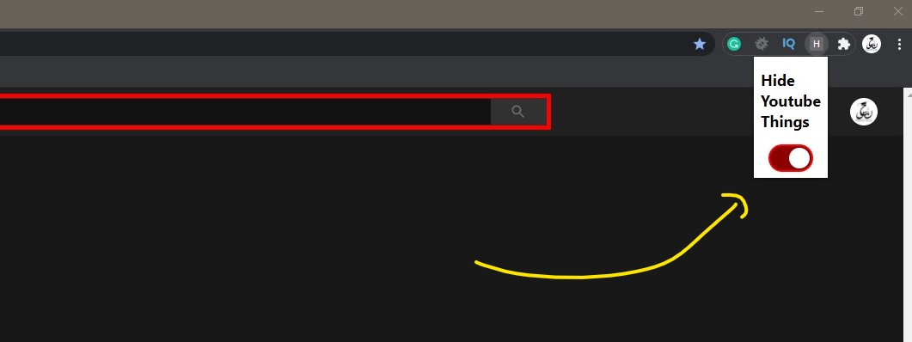
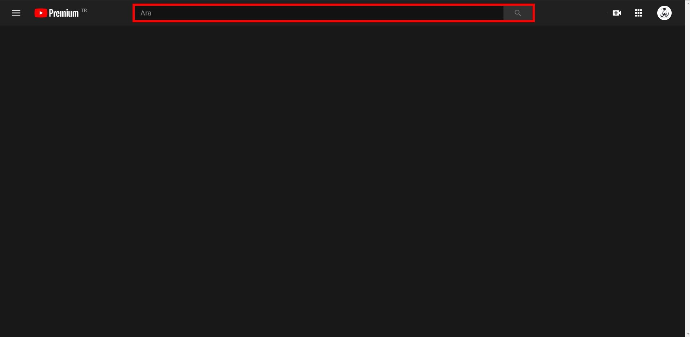
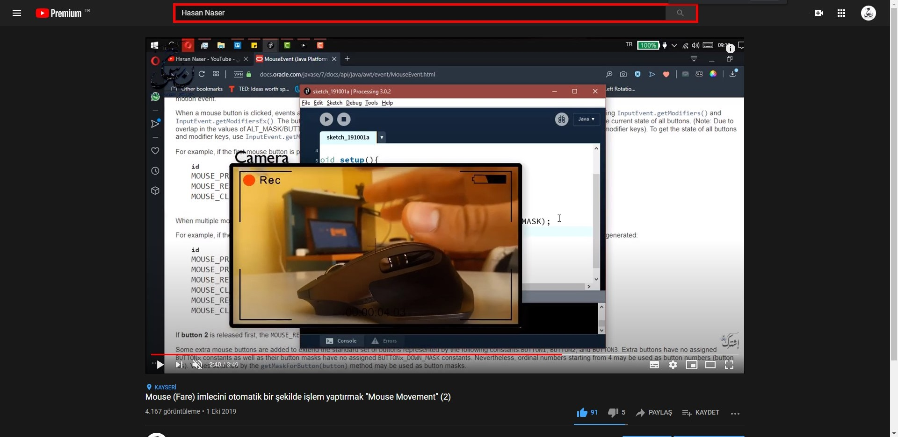

 

  # Hide YouTube Homepage Related Videos Feed, Recommended Videos, Comments 

  A browser extension to remove YouTube recommended sidebar,
  user comments, homepa  ge related videos feed, 
  Toggle the option through the popup 
  
  1- Go to <code> chrome://extensions </code>
  in the target Chrome browser and enable "Developer mode" by the checkbox in the upper right.
  
  2- Press “Load unpacked extension…” and choose the version-number folder inside the desired extension folder.
    
  
 

